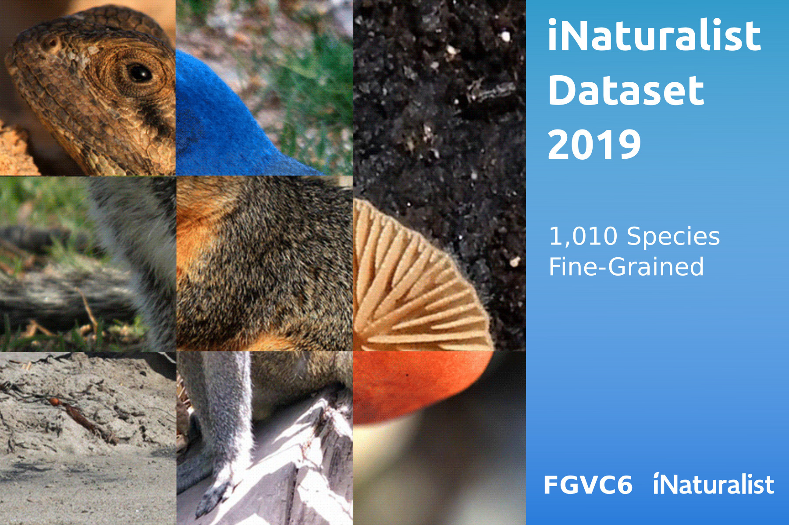

# iNaturalist 2019 Competition
The 2019 competition is part of the [FGVC^6 workshop](https://sites.google.com/view/fgvc6/home) at [CVPR](http://cvpr2019.thecvf.com/).

Please open an issue if you have questions or problems with the dataset.

## Updates
February 15th, 2021:
  * AWS Open Data download links now freely available. See the [Data](#Data) section below.

August 19th, 2020:
  * AWS S3 download links were created due to problems with the original Caltech links. The dataset files are in a "requester pays" bucket, so you will need to download them through an AWS API. See the [Data](#Data) section below. 

August 6th, 2019: 
  * Un-obfuscated names are released. Simply replace the `categories` list in the dataset files with the list found in this [file](https://ml-inat-competition-datasets.s3.amazonaws.com/2019/categories.json.tar.gz).

  * Thanks to everyone who attended and participated in the [FGVC6 workshop](https://sites.google.com/view/fgvc6/home)! Slides from the competition overview can be found [here](https://drive.google.com/file/d/1Ah5haDF6kFioQzy45-HKTsxZCqGwondf/view).

## Kaggle
We are using Kaggle to host the leaderboard. Checkout the competition page [here](https://www.kaggle.com/c/inaturalist-2019-fgvc6).

## Dates
|||
|------|---------------|
Data Released|March, 2019|
Submission Server Open |March, 2019|
Submission Deadline|June, 2019|
Winners Announced|June, 2019|

## Details
There are a total of 1,010 species in the dataset, spanning 72 genera, with a combined training and validation set of 268,243 images. The dataset was constructed such that each genera contains at least 10 species, making the dataset inherently fine-grained. 


## Evaluation
This competition employs average top-1 error. For each image $i$, an algorithm will produce 1 label $l_i$. Each image has one ground truth label $g_i$, and the error for that image is:
$$
e_i = d(l_i, g_i)
$$
Where
$$
d(x, y) =
\begin{cases}
    0       & \quad \text{if } x = y \\
    1  & \quad \text{otherwise}\\
\end{cases}
$$

The overall error score for an algorithm is the average error over all $N$ test images:
$$
\text{score} = \frac{1}{N} \sum_{i} e_{i}
$$

## Differences from iNaturalist 2018 Competition
The primary difference between the 2019 competition and the [2018 Competition](../2018) is the way species were selected for the dataset. For the 2019 dataset, we filtered out all species that had insufficient observations. From this reduced set, we filtered out all species that were not members of genera with at least 10 species remaining. This produced a dataset of 72 genera, each with at least 10 species, for a total of 1,010 species. Our aim was to produce a collection of fine-grained problems that are representative of the natural world. We made the evalue metric more strict in 2019, going to top-1 error as opposed to top-3. 


## Guidelines

Participants are welcome to use the [iNaturalist 2018](../2018) and [iNaturalist 2017](../2017) competition datasets as an additional data source. There is an overlap between the 2017 & 2018 species and the 2019 species, however we do not provide a mapping. Besides using the 2017 and 2018 datasets, participants are restricted from collecting additional natural world data for the 2019 competition. Pretrained models may be used to construct the algorithms (e.g. ImageNet pretrained models, or iNaturalist 2017 pretrained models). Please specify any and all external data used for training when uploading results.

The general rule is that participants should only use the provided training and validation images (with the exception of the allowed pretrained models) to train a model to classify the test images. We do not want participants crawling the web in search of additional data for the target categories. Participants should be in the mindset that this is the only data available for these categories.

Participants are allowed to collect additional annotations (e.g. bounding boxes, keypoints) on the provided training and validation sets. Teams should specify that they collected additional annotations when submitting results.

## Annotation Format
We follow the annotation format of the [COCO dataset](http://mscoco.org/dataset/#download) and add additional fields. The annotations are stored in the [JSON format](http://www.json.org/) and are organized as follows:
```
{
  "info" : info,
  "images" : [image],
  "categories" : [category],
  "annotations" : [annotation],
  "licenses" : [license]
}

info{
  "year" : int,
  "version" : str,
  "description" : str,
  "contributor" : str,
  "url" : str,
  "date_created" : datetime,
}

image{
  "id" : int,
  "width" : int,
  "height" : int,
  "file_name" : str,
  "license" : int,
  "rights_holder" : str
}

category{
  "id" : int,
  "name" : str,
  "kingdom" : str,
  "phylum" : str,
  "class" : str,
  "order" : str,
  "family" : str,
  "genus" : str
}

annotation{
  "id" : int,
  "image_id" : int,
  "category_id" : int
}

license{
  "id" : int,
  "name" : str,
  "url" : str
}
```

## Submission Format

The submission format for the Kaggle competition is a csv file with the following format:
```
id,predicted
12345,0
67890,83
```
The `id` column corresponds to the test image id. The `predicted` column corresponds to the predicted category ids. You should have one row for each test image.

## Terms of Use

By downloading this dataset you agree to the following terms:

1. You will abide by the [iNaturalist Terms of Service](https://www.inaturalist.org/pages/terms)
2. You will use the data only for non-commercial research and educational purposes.
3. You will NOT distribute the above images.
4. The California Institute of Technology makes no representations or warranties regarding the data, including but not limited to warranties of non-infringement or fitness for a particular purpose.
5. You accept full responsibility for your use of the data and shall defend and indemnify the California Institute of Technology, including its employees, officers and agents, against any and all claims arising from your use of the data, including but not limited to your use of any copies of copyrighted images that you may create from the data.

## Data

The dataset is freely available through the AWS Open Data Program. Download the dataset files here:
  * [All training and validation images [74GB]](https://ml-inat-competition-datasets.s3.amazonaws.com/2019/train_val2019.tar.gz)
      * s3://ml-inat-competition-datasets/2019/train_val2019.tar.gz
      * Running `md5sum train_val2019.tar.gz` should produce `c60a6e2962c9b8ccbd458d12c8582644`
      * Images have a max dimension of 800px and have been converted to JPEG format
      * Untaring the images creates a directory structure like `train_val2019/super category/category/image.jpg`. This may take a while.
  * [Training annotations [13MB]](https://ml-inat-competition-datasets.s3.amazonaws.com/2019/train2019.json.tar.gz)
      * s3://ml-inat-competition-datasets/2019/train2019.json.tar.gz
      * Running `md5sum train2019.json.tar.gz` should produce `b06a6683537867c0d5c7a45f407a306d`
  * [Validation annotations [156KB]](https://ml-inat-competition-datasets.s3.amazonaws.com/2019/val2019.json.tar.gz)
      * s3://ml-inat-competition-datasets/2019/val2019.json.tar.gz
      * Running `md5sum val2019.json.tar.gz` should produce `5cc5509b0fe495f1c8c1362612448497`
  * [Test images [8.6GB]](https://ml-inat-competition-datasets.s3.amazonaws.com/2019/test2019.tar.gz)
      * s3://ml-inat-competition-datasets/2019/test2019.tar.gz
      * Running `md5sum test2019.tar.gz` should produce `6966703cc589a877689dc8993bb3e55e`
      * Images have a max dimension of 800px and have been converted to JPEG format
      * Untaring the images creates a directory structure like `test2019/image.jpg`.
  * [Test image info [1.3MB]](https://ml-inat-competition-datasets.s3.amazonaws.com/2019/test2019.json.tar.gz)
      * s3://ml-inat-competition-datasets/2019/test2019.json.tar.gz
      * Running `md5sum test2019.json.tar.gz` should produce `f3208996d9f675462cb00d2f18cbb28c`
  * [Un-obfuscated category names](https://ml-inat-competition-datasets.s3.amazonaws.com/2019/categories.json.tar.gz)
      * s3://ml-inat-competition-datasets/2019/categories.json.tar.gz

Example [s3cmd](https://s3tools.org/s3cmd) usage for downloading the training and validation images:
```
pip install s3cmd

s3cmd \
--access_key XXXXXXXXXXXXXXXXXXXX \
--secret_key XXXXXXXXXXXXXXXXXXXXXXXXXXXXXXXXXXXXXXXX \
get s3://ml-inat-competition-datasets/2019/train_val2019.tar.gz .
```

Kaggle is also hosting the dataset and can be downloaded by joining the [competition](https://www.kaggle.com/c/inaturalist-2019-fgvc6) and going to the [Data page](https://www.kaggle.com/c/inaturalist-2019-fgvc6/data). 


## Previous Competitions
* [2018 Competition](../2018)
* [2017 Competition](../2017)
