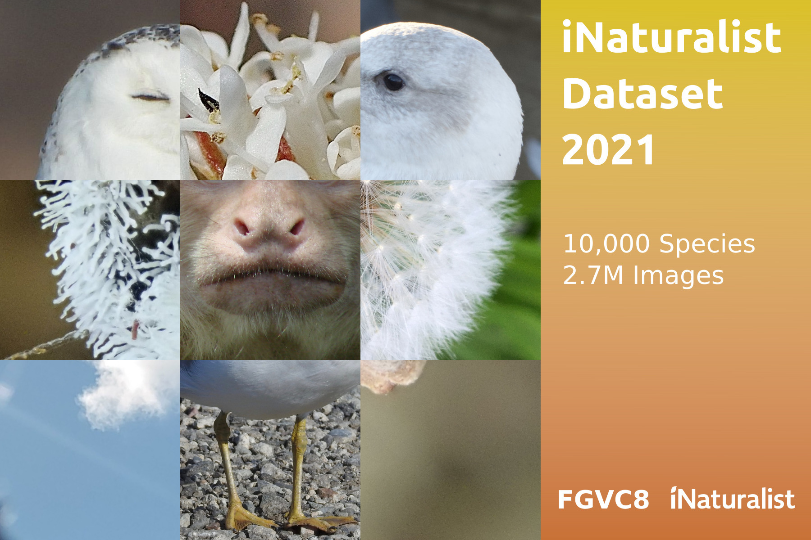
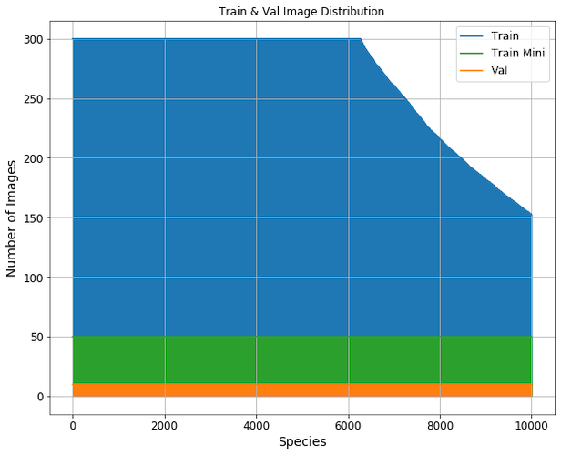
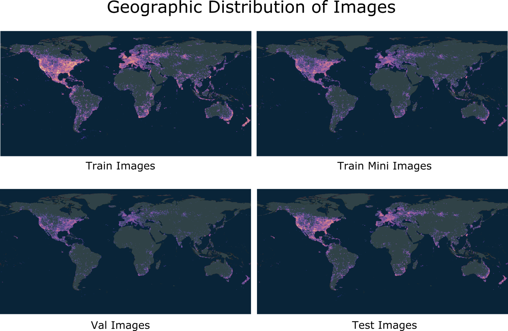

# iNaturalist 2021 Competition
The 2021 competition is part of the [FGVC^8 workshop](https://sites.google.com/view/fgvc8/home) at [CVPR](http://cvpr2021.thecvf.com/).

Please open an issue if you have questions or problems with the dataset.

## Updates
March 3, 2021:
  * Updating evaluation metric, and launching [Kaggle competition](https://www.kaggle.com/c/inaturalist-2021).

March 2, 2021:
  * Adding dataset download links.

February 24, 2021:
  * Including dataset description and figures.

February 13, 2021:
  * Mocking up 2021 page. Preparing dataset files. 

## Kaggle
We are using Kaggle to host the leaderboard. Checkout the competition page [here](https://www.kaggle.com/c/inaturalist-2021).

## Dates
|||
|------|---------------|
Dataset Released |March, 2021|
Submission Server Open |March, 2021|

## Details
There is a total of 10,000 species in the dataset. The full training dataset contains nearly 2.7M images. To make the dataset more accessible we have also created a "mini" training dataset with 50 examples per species for a total of 500K images. Each species has 10 validation images. There are a total of 500,000 test images. 

| Super Category | Species Count | Train Images | Train Mini Images | Val Images | Test Images |
| ---- | ---- | ---- | ---- | ---- | ---- |
Plants|4,271|1,148,702|213,550|42,710|x|
Insects|2,526|663,682|126,300|25,260|x|
Birds|1,486|414,847|74,300|14,860|x|
Fungi|341|90,048|17,050|3,410|x|
Reptiles|313|86,830|15,650|3,130|x|
Mammals|246|68,917|12,300|2,460|x|
Ray-finned Fishes|183|45,166|9,150|1,830|x|
Amphibians|170|46,252|8,500|1,700|x|
Mollusks|169|44,670|8,450|1,690|x|
Arachnids|153|40,687|7,650|1,530|x|
Animalia|142|37,042|7,100|1,420|x|
||||||
Total|10,000|2,686,843|500,000|100,000|500,000|





## Evaluation
We are using top-1 error as the evaluation metric for the Kaggle competition. For each image , an algorithm will produce one label  and we will compare this label to the ground truth label for the image , computing the error as: 
<p align="center"></p>

The overall error score for an algorithm is the average error over all  test images:
<p align="center"></p>

A top-1 metric is unforgiving and will allow us to test the limits of image classification performance. We acknowledge that there are problems with a top-1 metric, which is why we traditionally have used a top-K metric. Some cases where a top-K metric is more appropriate include: 
  1. Images where multiple species are present (e.g. a bee on a flower) and therefore it is ambiguous to decide which species an algorithm should report.  
  2. Images where the ground truth label is noisy. A top-k metric would smooth over this noise.
  3. Species that are visually identical, and separated geographically. 

For (1.) we assume truly ambiguous cases to be rare and assume the subject of the photo is the target species to identify (see [here](https://vimeo.com/167341998) for a video from iNaturalist describing "How to Take Identifiable Photos"). For (2.) this is an unfortunate reality of large scale datasets. For (3.) we are providing competitors with location and date information to help disambiguate these cases, should they wish to use it.

Note that while the Kaggle competition leaderboard is computed using top-1 error, competitors are *required* to submit 5 labels per image so that the organizers can study top-K performance. We will present the analysis at the FGVC8 workshop. See the [Submission Format](#Submission%20Format) section below. 

## Differences from Previous Competitions
We made a few modifications to the competition this year. Similar to the [2017](../2017) competition, we are releasing the species names immediately, instead of obfuscating them. Our reason for obfuscating them in [2018](../2018) and [2019](../2019) was to make it difficult for competitors to scrape the web (or iNaturalist itself) for additional images. Because we are releasing 2.7M training images and the dataset doesn't necessarily focus on the long tail problem we feel that we can release the species names without worry. This does not mean that scraping is allowed. Please do not scrape for additional data, especially from iNaturalist or GBIF. Having the species names also makes interpreting validation results easier when examining confusion matrices and accuracy statistics. 

We are also releasing location and date information for each image in the form of `latitude`, `longitude`, `location_uncertainty`, and `date` values. We have retroactively added this information to the [2017](../2017) and [2018](../2018) datasets, but this year competitors are able to utilize this information when building models. We hope this motivates competitors to devise interesting solutions to this large scale problem. 

## Guidelines
Participants are welcome to use previous iNaturalist competition datasets ([2017](../2017/), [2018](../2018), [2019](../2019)) as an additional data source. However we do not provide a category or image mappings between the datasets and there is certainly overlap between the species and images included in the various datasets. Besides using previous iNaturalist competition datasets, participants are forbidden from collecting additional natural world data for the 2021 competition. Weights from models trained on ImageNet, COCO, and previous iNaturalist competition datasets may be used to initialize models. Models pretrained on other datasets are not allowed. Please specify any and all external data used for training when uploading results.

The general rule is that participants should only use the provided training and validation images (with the exception of the allowed pretrained models) to train a model to classify the test images. We do not want participants crawling the web in search of additional data for the target categories. Participants should be in the mindset that this is the only data available for these categories.

Participants are allowed to collect additional annotations (e.g. bounding boxes, keypoints) on the provided training and validation sets, however they should not annotate the test images. Teams should specify that they collected additional annotations when submitting results.

## Annotation Format
We follow the annotation format of the [COCO dataset](http://mscoco.org/dataset/#download) and add additional fields. The annotations are stored in the [JSON format](http://www.json.org/) and are organized as follows:
```
{
  "info" : info,
  "images" : [image],
  "categories" : [category],
  "annotations" : [annotation],
  "licenses" : [license]
}

info{
  "year" : int,
  "version" : str,
  "description" : str,
  "contributor" : str,
  "url" : str,
  "date_created" : str,
}

image{
  "id" : int,
  "width" : int,
  "height" : int,
  "file_name" : str,
  "license" : int,
  "rights_holder" : str,
  "date": str,
  "latitude": float,
  "longitude": float,
  "location_uncertainty": int,
}

category{
  "id" : int,
  "name" : str,
  "common_name" : str,
  "supercategory" : str,
  "kingdom" : str,
  "phylum" : str,
  "class" : str,
  "order" : str,
  "family" : str,
  "genus" : str,
  "specific_epithet" : str,
  "image_dir_name" : str,
}

annotation{
  "id" : int,
  "image_id" : int,
  "category_id" : int
}

license{
  "id" : int,
  "name" : str,
  "url" : str
}
```

### Annotation Format Notes:
  * It is possible for the `latitude`, `longitude`, and `location_uncertainty` fields to be `null` when the values were missing from the respective iNaturalist observation (due to the location being private or the species being sensitive).
  * `location_uncertainty` is measured in meters, and may contain bogus values such as `-80` and `106807033`. We decided to provide the raw values that we obtained from iNaturalist instead of sanitized values.
  * The `test.json` file does not have the `annotations` field. You can only evaluate on the test set by uploading your submission to the Kaggle competition. 

## Submission Format

The submission format for the Kaggle competition is a csv file with the following format:
```
Id,Predicted
1,9279 608 1220 6626 8696
2,3821 4951 4833 7040 6913
3,4112 4061 7453 7540 2348
```
The `Id` column corresponds to the test image id. The `Predicted` column corresponds to 5 category ids, separated by spaces. You should have one row for each test image, and the 5 category labels should be sorted in order of decreasing confidence (the most confident category is the first category label). The Kaggle leaderboard will be computed using top-1 error (see the [Evaluation](#Evaluation) section above), and the competition organizers will study top-K error using the remaining predictions and present the results at the FGVC8 workshop.

*Your submission file must have 5 category predictions per image or the Kaggle evaluation will fail.*

## Terms of Use
By downloading this dataset you agree to the following terms:

1. You will abide by the [iNaturalist Terms of Service](https://www.inaturalist.org/pages/terms).
2. You will use the data only for non-commercial research and educational purposes.
3. You will NOT distribute the dataset images.
4. Cornell University makes no representations or warranties regarding the data, including but not limited to warranties of non-infringement or fitness for a particular purpose.
5. You accept full responsibility for your use of the data and shall defend and indemnify Cornell University, including its employees, officers and agents, against any and all claims arising from your use of the data, including but not limited to your use of any copies of copyrighted images that you may create from the data.

## Data

The dataset files are available through the AWS Open Data Program:
  * [Train Images [224GB]](https://ml-inat-competition-datasets.s3.amazonaws.com/2021/train.tar.gz)
      * s3://ml-inat-competition-datasets/2021/train.tar.gz
      * Running `md5sum train.tar.gz` should produce `e0526d53c7f7b2e3167b2b43bb2690ed`
      * Images have a max dimension of 500px and have been converted to JPEG format
      * Untaring the images creates a directory structure like `train/category/image.jpg`. This may take a while.
  * [Train Annotations [221MB]](https://ml-inat-competition-datasets.s3.amazonaws.com/2021/train.json.tar.gz)
      * s3://ml-inat-competition-datasets/2021/train.json.tar.gz
      * Running `md5sum train.json.tar.gz` should produce `38a7bb733f7a09214d44293460ec0021`
  * [Train Mini Images [42GB]](https://ml-inat-competition-datasets.s3.amazonaws.com/2021/train_mini.tar.gz)
      * s3://ml-inat-competition-datasets/2021/train_mini.tar.gz
      * Running `md5sum train_mini.tar.gz` should produce `db6ed8330e634445efc8fec83ae81442`
      * Images have a max dimension of 500px and have been converted to JPEG format
      * Untaring the images creates a directory structure like `train_mini/category/image.jpg`. This may take a while.
  * [Train Mini Annotations [45MB]](https://ml-inat-competition-datasets.s3.amazonaws.com/2021/train_mini.json.tar.gz)
      * s3://ml-inat-competition-datasets/2021/train_mini.json.tar.gz
      * Running `md5sum train_mini.json.tar.gz` should produce `395a35be3651d86dc3b0d365b8ea5f92`
  * [Validation Images [8.4GB]](https://ml-inat-competition-datasets.s3.amazonaws.com/2021/val.tar.gz)
      * s3://ml-inat-competition-datasets/2021/val.tar.gz
      * Running `md5sum val.tar.gz` should produce `f6f6e0e242e3d4c9569ba56400938afc`
      * Images have a max dimension of 500px and have been converted to JPEG format
      * Untaring the images creates a directory structure like `val/category/image.jpg`. This may take a while.
  * [Validation Annotations [9.4MB]](https://ml-inat-competition-datasets.s3.amazonaws.com/2021/val.json.tar.gz)
      * s3://ml-inat-competition-datasets/2021/val.json.tar.gz
      * Running `md5sum val.json.tar.gz` should produce `4d761e0f6a86cc63e8f7afc91f6a8f0b`
  * [Test Images [43GB]](https://ml-inat-competition-datasets.s3.amazonaws.com/2021/public_test.tar.gz)
      * s3://ml-inat-competition-datasets/2021/public_test.tar.gz
      * Running `md5sum public_test.tar.gz` should produce `7124b949fe79bfa7f7019a15ef3dbd06`
      * Images have a max dimension of 500px and have been converted to JPEG format
      * Untaring the images creates a directory structure like `public_test/image.jpg`.
  * [Test Info [21MB]](https://ml-inat-competition-datasets.s3.amazonaws.com/2021/public_test.json.tar.gz)
      * s3://ml-inat-competition-datasets/2021/public_test.json.tar.gz
      * Running `md5sum public_test.json.tar.gz` should produce `7a9413db55c6fa452824469cc7dd9d3d`

## Previous Competitions
* [2019 Competition](../2019)
* [2018 Competition](../2018)
* [2017 Competition](../2017)
